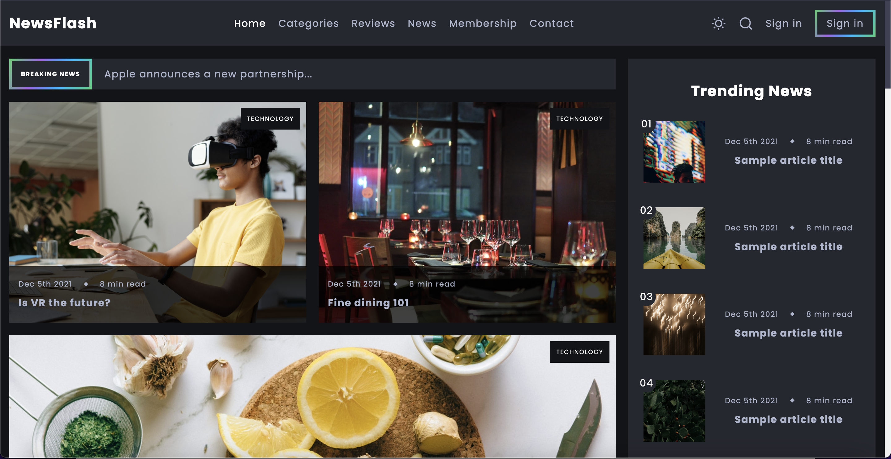

# freeCodeCamp - Frontend Development Course - Create a Blog with HTML & CSS

This is a project/tutorial from the freeCodeCamp YouTube channel: [Frontend Development Course - Create a Blog with HTML & CSS](https://www.youtube.com/watch?v=Aj7HLsJenVg).

freeCodeCamp is a nonprofit organization. The purpose is to help people learn to code for free.

## Table of contents

- [Overview](#overview)
  - [Screenshot](#screenshot)
  - [Links](#links)
- [My process](#my-process)
  - [Built with](#built-with)
  - [Project highlights](#project-highlights)
- [Conlusion](#conclusion)
- [Author](#author)

## Overview

### Screenshot



### Links

- Solution URL: [https://github.com/LucLhote/freeCodeCampTuto-Blog-with-HTML-CSS-JS](https://github.com/LucLhote/freeCodeCampTuto-Blog-with-HTML-CSS-JS)
- Live Site URL: [https://luclhote.github.io/freeCodeCampTuto-Blog-with-HTML-CSS-JS](https://luclhote.github.io/freeCodeCampTuto-Blog-with-HTML-CSS-JS)

## My process

### Built with

- Semantic HTML5 markup
- CSS custom properties
- JavaScript
- Grid
- Flexbox
- Mobile First Design

### Project highlights

This project was interesting to work on. It allowed me to see another developer's approach and see how simple certain tasks can be done, like dark mode and light mode of a page just by applying a class and changing some values of variables:

```css
body.light-theme {
    --light-color: #3d3d3d;
    --light-color-alt: rgba(0, 0, 0, .6);
    --primary-background-color: #fff;
    --secondary-background-color: #f1f1f1;
    --hover-light-color: #fff;
    --transparent-dark-color: #f1f1f1;
    --transparent-light-color: rgba(0, 0, 0, .1);
}
```

During my previous degree, I was disappointed to have learned to code in HTML and CSS without really applying JavaScript to create interactive pages, except when I had to use the Node.js framework. This project was an opportunity to do so without the event listeners:

```js
//Nav styles on scroll
const scrollHeader = () => {
    const headerElement = selectElement('#header');
    if (this.scrollY >= 15) {
        headerElement.classList.add('activated');
    } else {
        headerElement.classList.remove('activated');
    }
}

window.addEventListener('scroll', scrollHeader);
```

When I work on a website, I usually start working on a desktop approach and then end up on a mobile approach. This project made me work backwards by starting to work from the mobile version to the computer version.

## Conclusion

It was my first time following a tutorial. I wanted to do this for a long time to see how other developers do it respectively. It's something I will do more because I believe I can become a better teammate and understand the code of the people I work with faster.

## Author

- Email - [luc.lhote@outlook.com](luc.lhote@outlook.com)
- Frontend Mentor - [@LucLhote](https://www.frontendmentor.io/profile/LucLhote)
- LinkedIn - [Luc Lhote](https://www.linkedin.com/in/luclhote/)
- freeCodeCamp - [@LucLh](https://www.freecodecamp.org/LucLh)
- freeCodeCamp Forum - [@LucLh](https://forum.freecodecamp.org/u/luclh/summary)
